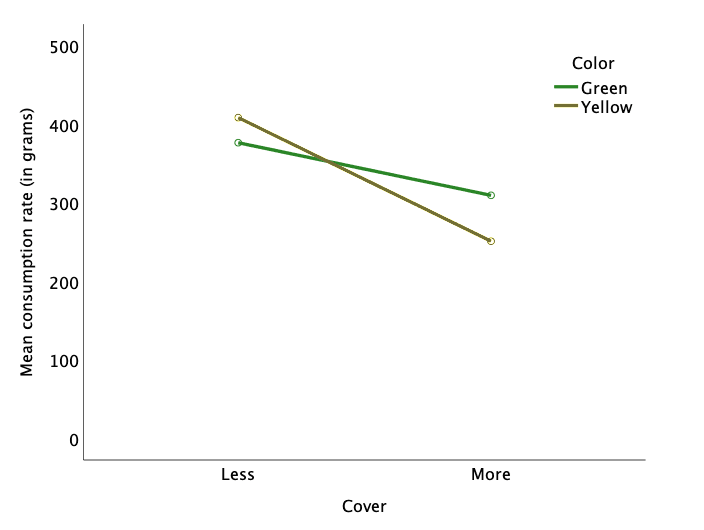
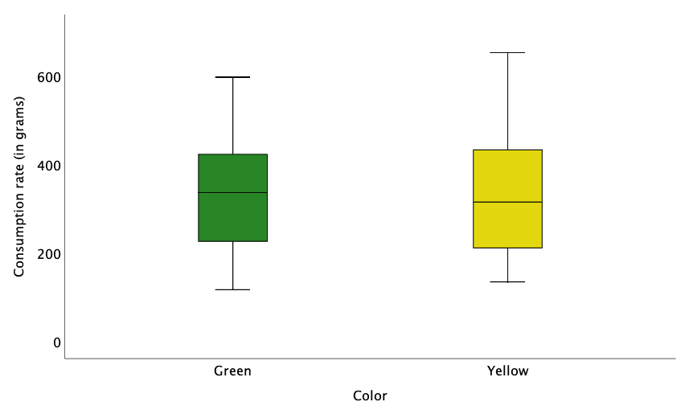

# Enterprise Statistical Applications

The competitive business environment encourages company leaders to look for best practices to implement throughout organizational activities.  Company leaders can benefit from establishing strategic plans that tie directly to the corporate vision, mission, and enterprise objectives.  Aligning company plans with the strategic mission and business objectives can make a big difference in how projects are initiated and implemented throughout business activities.  To assist with corporate planning, organizational activities, and project steps, technical managers can utilize statistical applications to assist with both planning and carrying out specific project requirements. For example, technical managers can apply descriptive and exploratory analytics, such as control charts or scatter plots to understand trends in the data to inform decision making.  In addition, technical managers can apply hypothesis testing through inferential statistics and even use data to predict future outcomes based on a set of inputs and assumptions.

Developing a well-organized plan for statistical applications can assist technical managers in preparing for successful business operations and strategy.  A key example is the ability of managers to formulate a methodology for testing hypotheses and applying statistical applications based on probability and analysis calculations supported by the use of software tools such as Python, R, SAS, SPSS, etc.  Designing an analytic framework and leveraging data will help guide decisions around business strategy, business planning, and operational improvements.

A connection of statistics with the use of software can assist technical managers and leaders with maintaining projects that align with business leader intentions.  Examples can include an analysis of the likelihood of events occurring, known as probability, and beneficial statistical analysis, which can include an examination of trends, anomalies, comparing averages between two groups, and looking at averages or trends across multiple groups. 

Figure 1 provides an example of a comparison between the food consumption of wild birds based on the color and location of the feeder.  This example is based on a 2 X 2 factorial analysis of variance (ANOVA), where the goal is to examine the extent to which bird feeder color (green vs. yellow), bird feeder location (more cover vs. less cover), and the interaction between the two independent variables impacts the amount of food consumed within a specific time frame.  As you see in Figure 1, the impact of cover on food consumption is greater when the bird feeder color is yellow.

Figure 1. Effect of cover on the rate of consumption (in grams) by feeder color constructed by Shutay (2019).

One final point here is that if you do not look for potential interactions in the data, you may miss important insights. For example, if you only looked at the distributional characteristics and measures of central tendency (e.g., means or medians) of one variable at a time, such as color, you would miss the fact that color is an important variable to consider when you combine it with the amount of cover.  Birds prefer yellow feeders, but only when there is less cover.  Figure 2 highlights the point that you would have missed an important insight if you had simply looked at color by itself.  Therefore, analyzing data is both an art and a science.

Figure 2. Boxplots depicting consumption rates (in grams) by feeder color constructed by Shutay (2019).
