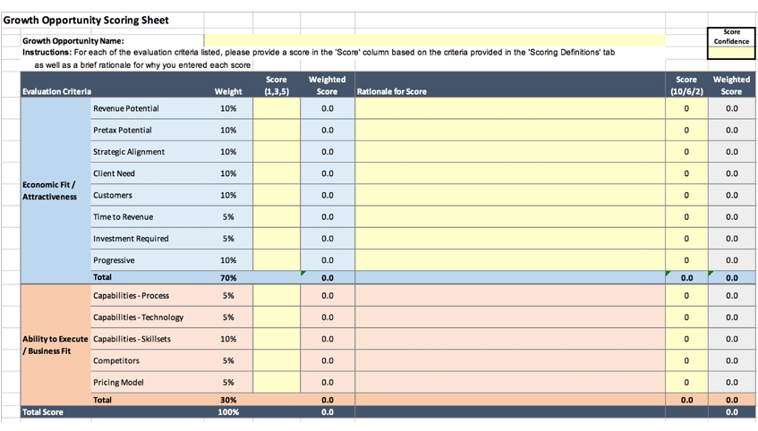
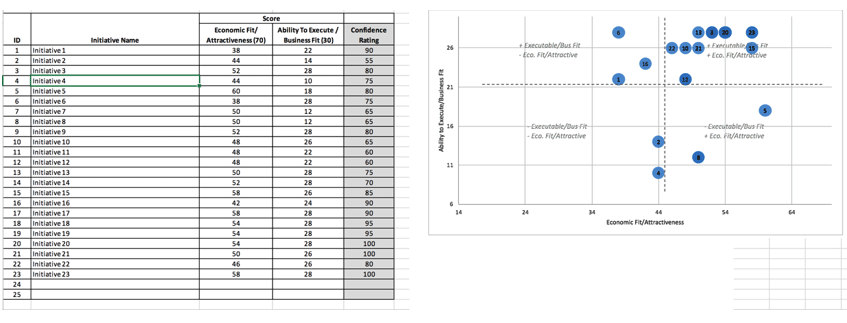

# Week 1: The art and science of statistical applications

Statistical applications, such as descriptive statistics, inferential statistics, and predictive analytics, require a combination of both art and science to achieve optimal results.  The art pertains to understanding and articulating the problem, knowing how and what to explore in the data, and generating insights in a story-like fashion based on the statistical output.  The science pertains to the design of experiments for hypothesis testing and the application of statistical and mathematical models and algorithms.

Descriptive statistics are used to explore and understand your data. For example, you will want to examine the distributional characteristics of your data and identify any potential anomalies or outliers in the data. While there are many different types of probability distributions, three of the most common include the Gaussian (e.g., normal distribution), the binomial, and the Poisson distribution. Gaussian distributions are used for quantitative variables that are normally distributed, while binomial distributions are used for binary variables (e.g., pass or fail, positive or negative test result), and Poisson distributions are used for count data (e.g., the number of people who enter a retail shop between 12-1pm on Saturdays).  In addition to looking at univariate distributions (distributions of a single variable), you will also want to look at bivariate (two variables) or multivariate (several variables) relationships between variables using visualizations such as scatter plots.

Inferential statistics are used for testing hypotheses.  For example, you might want to compare groups using t-tests or analysis of variance, or you may want to examine the extent to which a set of variables are correlated.  Inferential statistics are used to estimate population parameters and to explain how things differ, change, or are related.  Often, inferential statistics are used to explain variances within distributions.  Within inferential statistics, there are parametric models and non-parametric models.  Parametric models are bound by statistical assumptions about the distribution such as normality, homogeneity of variance (if comparing groups), linearity, etc.  Non-parametric inferential models are not bound by distributional assumptions.

Predictive analytics are used for making predictions based on an inferential model or a machine learning algorithm.  For example, once you are able to test hypotheses about relationships between variables and/or cause and effect, you can use that information to make predictions about the future such as whether a person will default on a loan, get divorced, commit a crime, contract a disease, or how much money a person will spend on a given purchase. Machine learning algorithms can be as simple as a linear or logistic regression equation or as complex as a deep artificial neural network with many hidden layers with very complex calculations that are not feasible by hand. 

Descriptive, inferential, and predictive statistics are interdependent in that you cannot make predictions without first exploring the data through descriptive statistics and testing relationships or cause and effect.  With that being said, the researcher must be cognizant of the fact that cause and effect cannot be determined without a very rigorous and controlled experiment. Finally, as previously indicated, getting the most out of statistical applications requires more than just mathematical, statistical, or machine learning models. The researcher must be knowledgeable about the content or subject matter of interest and be creative in their approach.

As part of this course, you will need to create a business case that explains why a particular project should be selected, given that resources will need to be allocated to your project. The example below, which is also provided as course interactive, is a practical example of how projects can be prioritized based on strategic alignment, economic factors, and execution feasibility.  Please feel free to modify this template as appropriate for your purposes.

Figure 3. Scoring rubric for analytical projects constructed by Shutay (2019).

Once all of the ratings are provided, the scores can be plotted in a four-quadrant chart as depicted below. This chart can be used to prioritize projects and to help substantiate your business case.

Figure 4. Example of a grid for plotting projects for prioritization constructed by Shutay (2019).

## Heads-Up to the Signature Assignment

The culminating signature assignment (due in Week 7) will require you to design a strategic plan for organizational continuous improvement or growth based on your design of an experimental and analysis of data. To ensure you are prepared and have adequate time to complete this assignment, please review the instructions by looking ahead to Week 7. Contact your professor if you have questions.

Review the weekly resources to prepare for this week’s assignments. The resources may include textbook reading assignments, journal articles, websites, links to tools or software, videos, handouts, rubrics, etc.
