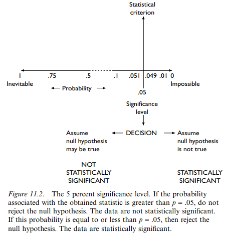

# Readings

## Statistical conclusion validity (2012)

> This resource explains the concept of statistical conclusion validity and provides suggestions for increasing statistical conclusion validity.

García-Pérez, M. A. (2012). Statistical conclusion validity: Some common threats and simple remedies. Frontiers in Psychology, 3. [https://doi.org/10.3389/fpsyg.2012.00325](https://doi.org/10.3389/fpsyg.2012.00325). [StatisticalConclusion.pdf](StatisticalConclusion.pdf).

### Are researchings correctly publishing statistically conclusions

A reoccuring challenge with statistical applications in research, is that the modeling is wrong.  When papers use erroneous calculations or do not correctly meet the threshold of the stated confidence interval, it creates invalid generalizations.  These results compound into the body of knowledge, with additional efforts building until eventually being proven wrong.

> More recently, Bakker and Wicherts (2011) conducted a thorough analysis of psychological papers and estimated that roughly 50% of published papers contain reporting errors, although they only checked whether the reported p value was correct and not whether the statistical test used was appropriate. A similar analysis carried out by Nieuwenhuis et al. (2011) revealed that 50% of the papers reporting the results of a comparison of two experimental effects in top neuroscience journals had used an incorrect statistical procedure. And Bland and Altman (2011) reported further data on the prevalence of incorrect statistical analyses of a similar nature.

### What is the influence of the sampling process

Research with `fixed sampling` choose the number of data points, collects the data, then performs the analysis.  In contrast `sequential sampling` uses an iterative model of collect, analyze, optionally repeat.

There are strengths and weaknesses to both strategies. For instance, fixed runs the risk of wasting significant resources before reaching a dead end.  However, sequential might give an inaccurate picture due to incomplete coverage.

> Frick (1998) proposed that repeated statistical testing be conducted under the so-called COAST (composite open adaptive sequential test) rule: If the test yields p < 0.01, stop collecting data and reject the null; if it yields p > 0.36, stop also and do not reject the null; otherwise, collect more data and re-test. The low criterion at 0.01 and the high criterion at 0.36 were selected through simulations so as to ensure a final Type-I error rate of 0.05 for paired-samples t tests.

### How can regression analysis help

Researchers can avoid the "damned if you do, damned if you dont" paradox of fixed versus sequential sampling by feeding partial datasets into logistic regression and correlation functions.  These strategies can tease-out structure and provide insights into the underlying structure and determine if appropriate coverage exists for each cluster.

### What is the key final take-aways

> Most breaches of SCV arise from a poor understanding of statistical procedures and the resultant inadequate usage. These problems can be easily corrected, as illustrated in this paper, but the problems will not have arisen if researchers had had a better statistical training in the first place. [...]  One way to eradicate the problem is by improving statistical education at undergraduate and graduate levels, perhaps not just focusing on giving formal training on a number of methods but by providing students with the necessary foundations that will subsequently allow them to understand and apply methods for which they received no explicit formal training.

## Threats to the Validity of Research (1993)

> This article provides an excellent overview of threats to validity in research design, which includes the four major types of validity (internal, external, statistical conclusion, and construct validity).

Parker, R. M. (1993). Threats to the Validity of Research. Rehabilitation Counseling Bulletin, 36(3), 130–138. [Direct Link](https://search-ebscohost-com.proxy1.ncu.edu/login.aspx?direct=true&db=eric&AN=EJ458938&site=eds-live).  [ThreatsToValidity.pdf](ThreatsToValidity.pdf).

> It is a widely accepted truism that all published research is flawed to some extent. Because the research enterprise is fraught with many pitfalls, researchers must become well versed in recognizing and, when possible, avoiding design shortcomings.

### What are internal/external threats to validation

These classes of issues can originate from internal and external sources.  For instance, determining causality could be skewed by poor selections by the researcher (`internal threats`) or volunteers sneaking into the study from the same group (`external threats`).  In either situtation the results are the same and e.g., `selection bias` creates an inaccurate representation.

- History of extraneous events
- Maturity of data set
- Testing processes
- Instrumentation and accuracy of measurements
- Statistical regression and inaccurate categorization
- Selection bias
- Mortality and partial data
- Interactions with selection and data intra dependencies
- Ambiguity of cause effort (A -> B or B -> A)

### What are threats to statistical conclusion validity

- Low statistical power (e.g., too small of sample size)
- Fishing and error rates (e.g., run all permutations until something happens to align)
- Low reliability of measures
- Random irrelevancies and other sources of noise
- Heterogeneity of variables (e.g., too many uncontrolled parameters)

### What are threats to construct validity

- Inadequate preoperational test construction
- Mono-operation and insufficient cross checks
- Mono-method and insufficient inclusion of alternatives (e.g., what is the full taxonomy)
- Changing control policies mid-experiment
- Control group seeks external influences
- Not following the agreed upon control procedures
- Information disclosure of control versus experiment participants
- Resentfulness of participants or creating incentives to lie and cheat
- Evaluation apprehension due to concerns of confidentiality
- Experimenter expectations influencing outcome data
- Nesting independent variables too many levels

## Designing and reporting experiments in psychology (2008)

> Chapters 9-13 cover design of experiments, including concepts such as internal and external validity.  Chapters 13 covers more advanced designs.  Chapters 10-12 are most critical. Please note that while the textbook covers concepts within a psychology framework, the concepts apply to all fields.

Harris, P. (2008). Designing and reporting experiments in psychology. New York, NY: McGraw-Hill Education. [ProQuest eBook](https://ebookcentral.proquest.com/lib/ncent-ebooks/detail.action?docID=345135). [DesignReportExperiments_Section2.pdf](DesignReportExperiments_Section2.pdf).

### 9: Experiments, correlation and description

This chapter provides an overview of the characteristics of experimentation.  In a nutshell, there are `independent and dependent variables` (measurements) that are influenced to produce a change.  This influence or `control` are the procedures that constrain the bounds of the experiment as a whole.

Defining the control process is critical and must eliminate external threats, such as _a sleeping study with patients taking arbitrary other medications_.  It can be challenging or impossible to draw meaningful conclusions for a study that uses dirty data.  This point connects back to [TIM-8130 Data Mining](https://github.com/dr-natetorious/TIM-8130-Data_Mining), and how 80% of research is data curation.

> An uncontrolled variable that changes along with our independent variable is known in the trade as a `confounding variable` (to confound = to confuse).

### 10: Basic experimental design

While designing an experiment is a relatively standard process, the choices of specific questions require more of an art form.  For instance, _does driving with music impact performance_?  This general question has many permutation such as what _aspect of music_ (indpendent) and what _driving statistic_ (dependent).  Perhaps, the music is categorical such as genre or continuous like volume.  Meanwhile, the statistic could be a measurement of speed consistency or alignment on the road.

### What are the challenges with [un-]related samples

Having many similar examples can remove extraneous factors that are specific to an individual.  However, it can also lead to bias and result skew.  One approach is to remove or compress these redundant values, but this can introduce `order effects`.  An order effect occurs when the sequence of samples into the process creates a subtle dependency on the final results.

One method for handling ordering effects is to use randomization.  Another solution is use `counterbalancing` to make the _counts of preceeding item -> item_ approximately equal. A third strategy is to use `matching pairs` which find two examples that are similar/random choosen, and then measure the experiment on the pair.

## 11: Statistics: significance testing

The objective of an experiment is to measure the `differences` between IV and DV variables.  This result comes from `both the conditionals and correlations` of the values.  Researchers need to use `inferential statistics` to quantify how relable are the results, and therefore how `generalizable`.

> To call our results statistically significant does not necessarily mean that they have much psychological importance. Likewise, results that are not statistically significant may yet be psychologically informative. Significance, in this context, is a statistical concept. It tells us something about the statistical nature of our data. The psychological importance of a set of findings, whether statistically significant or not, remains to be established.

## 12: Statistics: effect size and power

After performing an experiment and measuring the statistical significance, a decision process needs to accept or reject the null hypothesis.  Instead of approaching this problem as a binary true/false, it is often better to ask `how big of an effect exists`.  This alternative perspective is critical because statistical results are more commonly points on a continuous range.

### How do I measure effect size

> For many years psychologists tended to ignore the issue of effect size and concentrated on whether or not an effect or a relationship was statistically significant. One psychologist in particular – Jacob Cohen – has been especially influential in making psychologists think more about the size of the effects that we report.

Effect size can be measured in standard deviation. One of the advantages of this is that we can then compare effect sizes across different experiments.

### How do I measure power

> [P]ower is the capacity of our study to detect this. That is, power is the probability of not making a type II error, of not failing to find a difference that is actually out there in the psychological universe. The power of a statistical test is its capacity to correctly reject the null hypothes.
> [...] Experiments vary in power. The more powerful the experiment is, the smaller are the effects it can detect. In this way, experiments to psychologists are like telescopes to astronomers. Very powerful telescopes can see even dim and distant stars. Likewise, very powerful experiments can detect even tiny effects of the IV on the DV. Lowpower experiments are like low-power telescopes.

### How do I increase power

There are several knobs available to the research team.  Depending on the specific-experiment, one aspect is typically more practical than another.

- Targeting a difference significance level
- Using one-tailed tests
- Employing parametric tests
- Increasing participants

### How do I report results

> In the results you can do the following, as I advised in Chapter 4:

1. Whenever possible, report the exact probabilities associated with the obtained values of your statistic, whether these are statistically significant or not.
2. Where appropriate, report standard deviations as well as means in tables of descriptive statistics.
3. If you know how, report appropriate confidence intervals such as the 95 percent confidence intervals around the mean, or for a difference between two means. You can do this regardless of whether or not the effects are statistically significant.

### Are statistical significance and effect the same thing

> One thing to avoid at all costs – especially in the DISCUSSION – is to confuse statistical significance with the size of the effect.  If the experiment or study is powerful enough, any difference between your conditions will be statistically significant, no matter how small it is numerically and trivial it is psychologically. (Many of you realize this intuitively when you write in your reports that "_our findings would have been significant if we had had more participants_". It is precisely because this is inevitably true that – unless you defend it sensibly – this remark tends to evoke the scorn and wrath of your marker.)

## 13: More advanced experimental design

In real-world experiments there are often multiple levels of independent variables, such as: gender, age, and nationality as three tiers of groupings.  While these more advanced structures can lead to greater insight, researchers need to be careful to not over complicate matters.

Initial ideas of the chapter tie back into [TIM-8130 Data Mining](https://github.com/dr-natetorious/TIM-8130-Data_Mining); and how essentially complex feature vectors result in more sophistication _provided_ ample data is available.  The authors propose around 20 samples per condition as a minimum bar -- which is roughly the rule of thumb of 8130's textbook.
