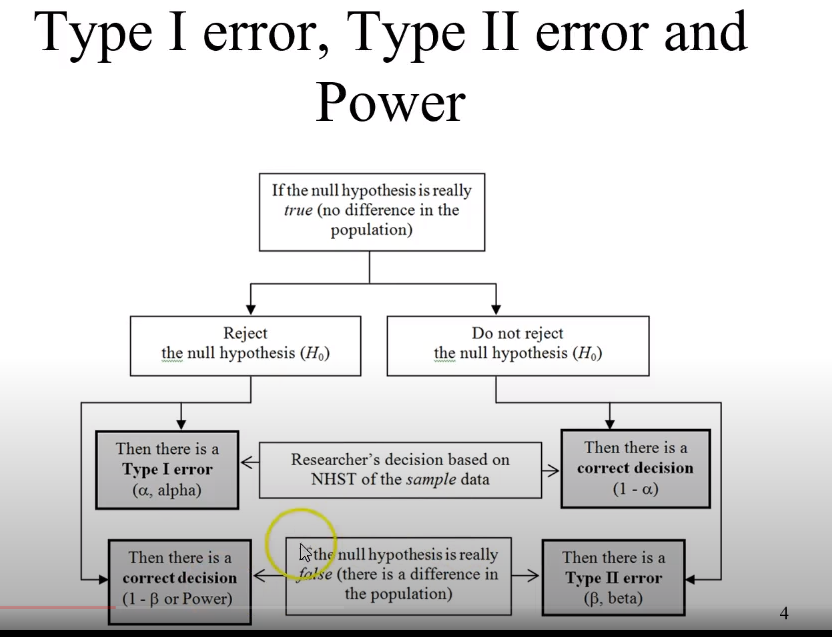

# Video Lessons

## Power and Effect Size

Donovan, C (2016). Power & Effect Size. YouTube. [YouTube](https://www.youtube.com/watch?v=9LVD9oLg1A0).

### What is Power

Cohen was the father of power analysis and defines `Cohen D` as `1 - Beta`.  You need to confirm there is _sufficient power before starting any analysis_.  This can detect the study it a waste of time upfront.

| Power Value | Value|
|-------------|-----|
| Excellent | +0.90 |
| Acceptable | +0.80|
| Adequate | +0.70 |

### How is power used

When a study begins the first step is to collect a sample and attempt to reject the null hypothesis.  If this decision concludes that a difference does not exist, that can be due to not having sufficient power to detect the deviation.  

For instance, _does cheese give you nightmares_? From a sample of 10 people, it might be inconclusive that there is a correlation.  However, to definitively state this generalization with high confidence requires a big enough sample.

### What influences power levels

- Alpha (confidence interval)
- Sample size
- Effect size
- Statistical type
- Type of design

### What is effect size

An `effect size` is the a measurement of the strength of a phenomenon. Essentially, it places the distribution of the null hypothesis and the hypothesis on the same plane.  Then _difference or correlation_ gives a quantiative answser.

### How does effect and power relate

Assume this experiment is performed:

| Aspect | Example|
|--------|--------|
| Hypothesis| Students that do statistics homework get better grades|
| Null Hypothesis|  Doing homework has no influence|
| Experiement| A group of students take the exam upfront, while another group takes the test after studying|
| Effect|  The two groups score distribution are plotted and "the score gain" is equal to the _effect of studying_|

### Effect on Power

Then logically:

1. *Large effect*. Few additional students necessary to prove generalization
2. *Small effect*. Lots of students necessary to prove generalization

