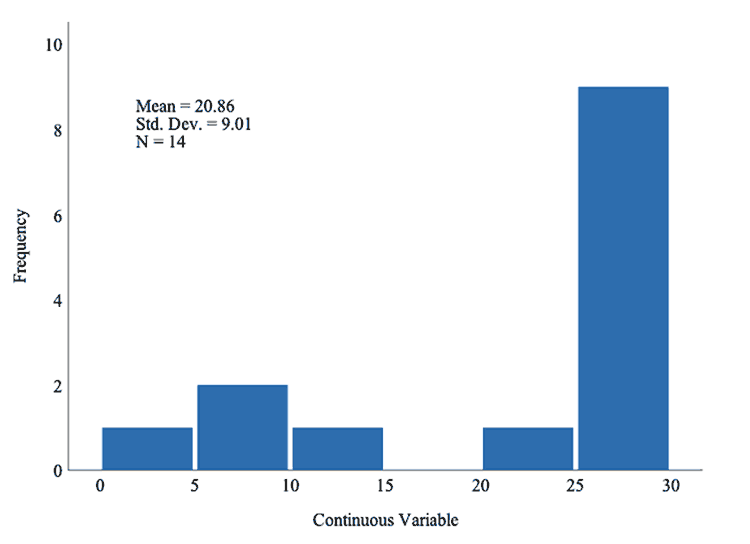

# Analyzing Enterprise Data for Continuous Improvement

As discussed previously in this course, your data analysis should begin with an exploration of the data.  You will want to get a sense for the completeness and accuracy of your data, the distributional characteristics of the variables (e.g., measures of central tendency and dispersion), and emergent trends in the data.  Data exploration should begin with the creation of descriptive statistics, including data visuals such as histograms, bar charts, box plots, scatter plots, and time series charts (if applicable).  These descriptive statistics and views help you to identify the data characteristics and potential problems with the data such as missing data, invalid data values, and anomalies or outliers.

When working with datasets, you will notice that missing data is fairly common. Data can be missing at random, or there can be a systematic pattern.  Systematic patterns are more problematic because they create a bias in the data.  Large quantities of missing data, even if missing at random, compromise the statistical conclusion validity of the data because the data may not sufficiently represent the population of interest.

Anomalies and outliers can represent invalid data points, so the first step in addressing them is to confirm that the data points are valid.  For example, if you have a continuous variable where the possible range of values is between 0 and 10, a value of 100 is not valid.  If the values are valid, then you may need to transform the data before conducting your analysis. For a nominal variable, you would need to ensure that the levels or labels in the data are valid.  For example, if the dataset only contains cases of mammals, then entries with a label of reptile are invalid.

In addition to identifying data quality issues, descriptive statistics (measures of central tendency and dispersion), and visualizations help you to determine the variable types (e.g., discrete or continuous) and the most appropriate distribution to assume and apply.  For example, normal or Gaussian distributions warrant the application of parametric statistical tests while non-normal distributions warrant the use of non-parametric statistical tests. The statistical conclusion validity of your findings will be greatly impacted by the methods you employ (e.g., sample recruitment strategy, sample size, alpha level, data cleaning methods, statistical model).

In the histogram displayed in Figure 6, you can see that there is continuous data, but the data do not follow a normal bell curve distribution.  Instead, the distribution is heavily negatively skewed.  Also, the mean is 20.86, which does not appropriately reflect the trend in the data.  Therefore, you should consider using non-parametric statistical tests (e.g., use the Mann-Whitney U test instead of the independent samples t-test).

Figure 6. Example of a negatively skewed continuous variable constructed by Shutay (2019).

Once you have addressed any data quality issues with your data (e.g., imputed data, deleted cases, transformations), the next step is to do another examination of the data characteristics with the final dataset so that you are able to select the most appropriate inferential model to test your statistical hypotheses based on the data attributes and characteristics.  If the data are ready for hypothesis testing, then you should employ your statistical model.  For example, for comparing two independent groups on a continuous variable that is normally distributed, you would use an independent samples t-test.  If you have more than two groups, you will use ANOVA.

Please refer to the Week 4 resources to help you identify the correct statistical test.  In addition, you are encouraged to review the resources for this week to prepare for this week’s assignments.
