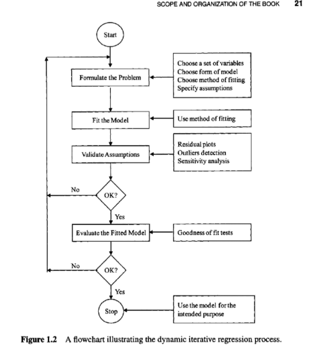
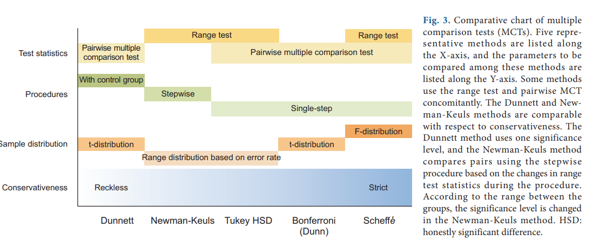
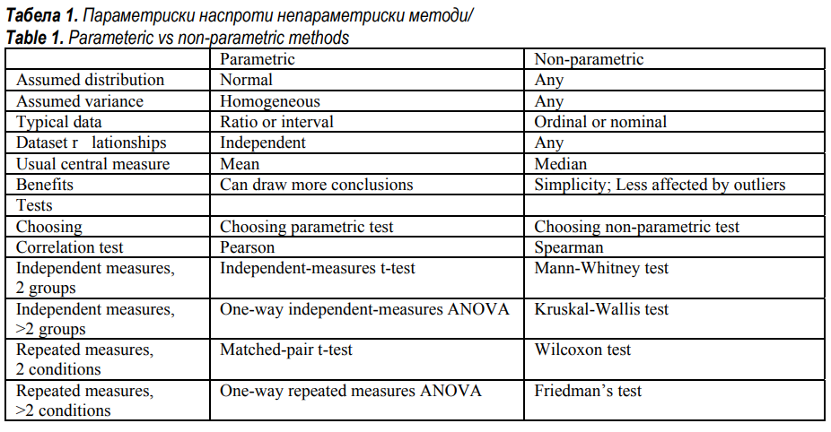

# Readings

## Regression analysis by example (2012)

Chatterjee, S., & Hadi, A. S. (2012). Regression analysis by example. Hoboken, New Jersey: John Wiley & Sons, Inc. [ProQuest](https://ebookcentral.proquest.com/lib/ncent-ebooks/detail.action?docID=918623).

### 1: What is regression analysis

Regression analysis is a common statistical approach for modeling the relationship of multiple variables.  It attempts to approximate a function that uses the parameter set to come to some known outcome.  After estimating this function, researchers can predict behaviors in other groups.

### 2: Simple Linear Regression

Measuring the `direction` and `strength` of a relationship requires calculating the `covariance` and `correlation coefficienct`.  After determining these values it can be useful to also determine `standard error rate` and the `confidence interval`, which are measurements of accuracy.

### 4: Regression diagnostics: detection of model violations

There are several risks to regression analysis that produce overfitting or erroneous solutions.

Assumption of...

- ... `linearity` that the model is simple versus hihgly dimensional
- ... `independently and identically distributed` (iid) normal random variables
- ... predictor variables are (a) non random (b) measured without error and (c) linearly independent (`collinearity`)
- ... observations are equally reliable and approximately equal influence

One strategy for proving or disproving these assumptions is to graphically present the data.

- Detect errors in the data
- Recognize patterns (e.g., clusters, outliers, gaps)
- Explore relationships
- Discover new phenomena
- Confirm or negate assumptions
- Assess adequancy of fitting
- Suggest remedial actions (e.g., transform, redesign, or additional collection)
- Enhance numerial analyses in general

Another strategy is to measure the influence of an individual point, using something like `Cook's distance`; which removes the `ith` data point then recalculates the regression line.  Similarly, Welsch and Kuh (1977) propose `DFITS` to derive a _difference in fit scaled_.  Hadi (1992) uses a _normalized residual_ to discover outliers in parameters and data points.

### 6: Transformation of variables

This chapter looks really useful.  I will come back to this after lunch.

## What is the proper way to apply the multiple comparison test (2018)

Sangseok Lee, & Dong Kyu Lee. (2018). What is the proper way to apply the multiple comparison test? Korean Journal of Anesthesiology, 71(5), 353–360. [https://doi-org.proxy1.ncu.edu/10.4097/kja.d.18.00242](https://doi-org.proxy1.ncu.edu/10.4097/kja.d.18.00242). [MultipleComparisonTests.pdf](MultipleComparisonTests.pdf).

When examining the `mean` of multiple groups it is often useful to perform an `analysis of variance (ANoVA)`.  These strategies (e.g., Tukey, Newman-Keuls, Bonferroni, Dunneet, Scheffe, ...) compare the similarity of two or more distributions.

The various methods attempt to determine the statistical significance or `P-value (probability value)`-- or likelyhood of an extreme value occurring.  One challenge with measuring the p-value comes from `alpha inflation` which means that the same group is measured over-and-over resulting in _greater confidence despite no additional evidence_.  Comparisons typically use a single-step or stepwise procedure, which [adds or removes parameters](https://youtu.be/AdFT17sq53s) to determine which features are most important.

> Many research designs use numerous sources of multiple comparison, such as multiple outcomes, multiple predictors,
subgroup analyses, multiple definitions for exposures and outcomes, multiple time points for outcomes (repeated measures), and multiple looks at the data during sequential interim monitoring. Therefore, multiple comparisons performed in a previous situation are accompanied by increased type I error problem, and it is necessary to adjust the P value accordingly.

## Anova and ancova: A glm approach (2012)

Rutherford, A. (2012). Anova and ancova: A glm approach. Hoboken, New Jersey: John Wiley & Sons, Inc. [ProQuest](https://ebookcentral.proquest.com/lib/ncent-ebooks/detail.action?docID=1011369).

### 1: Introduction to General Linear Models: Regression, Analysis of Variance, and Analysis of Covariance

### 2: Traditional and GLM Approaches to Independent Measures Single Factor ANOVA Designs

### 3: Comparing Experimental Condition Means, Multiple Hypothesis Testing, Type 1 Error, and a Basic Data Analysis Strategy

### 4: Measures of Effect Size and Strength of Association, Power, and Sample Size

### 5: GLM Approaches to Independent Measures Factorial Designs

## Exploring data in R (2018)

Shaughnessy, A., Prener, C., & Hasenmueller, E. (2018). Exploring data in R. [GitHub](https://shaughnessyar.github.io/driftR/articles/ExploringData.html).  [ExploringDataR.pdf](ExploringDataR.pdf).

This tutorial shows how to load data into an R-script, then perform the various calculations discussed in this weeks material.

## How to Select Appropriate Statistical Tests in Scientific Articles (2016)

Trajkovski, V. (2016). How to Select Appropriate Statistical Tests in Scientific Articles. Journal of Special Education & Rehabilitation. 7(3/4), 5–28. [https://doi-org.proxy1.ncu.edu/10.19057/jser.2016.7](https://doi-org.proxy1.ncu.edu/10.19057/jser.2016.7). [SelectStatisticalTests.pdf](SelectStatisticalTests.pdf).

A common challenge in research is choosing the correct statistical test to describe the specific scenario.  When inexperienced authors use the wrong metric it lowers the credibility of the work and can provide inaccuate conclusions.  Several large journals are addressing these issues with dedicated editor of statistics, however, this role is still under represented in the broader publishing world.

### What are parametric versus non-parametric methods

A parametric distribution (e.g., normal distribution) allows the researchers to make certain assumptions about the likelihood of values appearing.  However, many real-life data sets have multiple classes or ranges of values that are more common than others (e.g., W and M shapes).  

When parametric tests are applied to non-parametric data, then the resulting calculations are inaccurate.

### What tests are valid for given feature

The given feature type dictates which statistical tests are compatible with its values.  For instance, it would not make sense to take the average of a nominal scale (e.g., categorical value), but determining a frequence ratio does.

| Data Type | Description| Example |
|-----------|-----------|---------|
|Nominal | Categorical| Gender or color|
|Ordinal|Ordered Qualitative| sad, happy, excited|
|Interval| Scaled values| age in years or weight in km|
|Ratio| Combines previous three into one value| $100 versus $1000 dollars|
