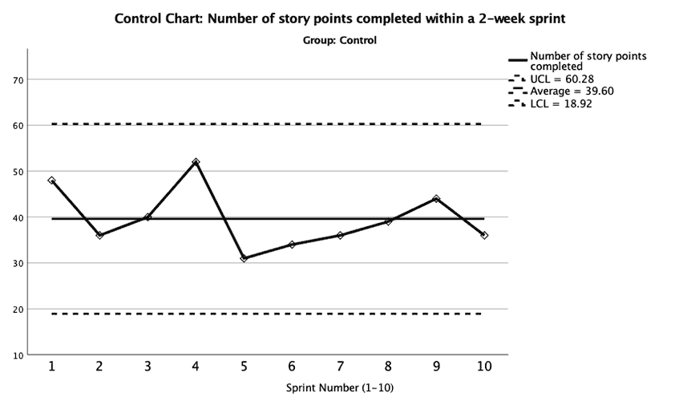
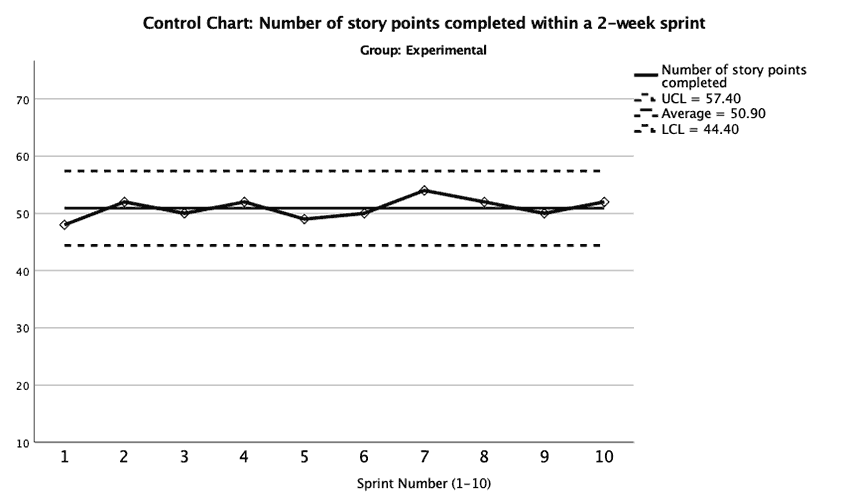

# Interpreting Enterprise Data Analysis Results

Once you have analyzed all of your data, it is time to interpret the results to answer the research questions and corresponding hypotheses, and determine what actions need to be taken as a result.  Your interpretation should include consideration and discussion of your limitations, along with a discussion of the insights, which should drive continuous improvement and/or growth within your organization.

The insights that are generated from your data analysis findings should be linked to your organizational strategy to help guide decision-making. Also, when providing recommendations to stakeholders, you will want to consider what is actually feasible within the constraints of your business. Remember, you will need to present your case, supported by your data, in a consumable and compelling manner.  Therefore, you need to speak to your stakeholders in a language that they can understand, and you have to make it meaningful to them; this includes your leadership, your peers, and your direct reports.

Figures 7 and 8 contain control charts for a control group and experimental group, respectively, for illustrative purposes. These control charts provide an example of results that you could obtain by implementing a two-group, pre-experimental design without a baseline (no pre vs. post).  The design is considered pre-experimental instead of experimental because the employees were not randomly assigned to the groups; they were intact groups, making the groups non-equivalent.  As you can see in the charts, the experimental group had a narrower band and greater statistical control.  In other words, the experimental group had less variability in their performance and were, therefore, more reliable or predictable in their productivity, and, they completed more story points on average than the control group.  Therefore, the experimental group’s performance is more reliable and productive.  However, do you know for sure that this is because of some organizational-related intervention?

Figure 7. Control chart featuring a number of stories points completed within 2-week sprints for control group constructed by Shutay (2019).

Figure 8. Control chart featuring a number of stories points completed within 2-week sprints for experimental group constructed by Shutay (2019).

As indicated in the course resource readings on validity threats (García-Pérez, 2012; Ohlund & Yu, n.d.), there are several reasons why the differences could have been achieved, which makes it difficult to say with high confidence that the differences are due to the treatment.  However, if you controlled for confounding variables as much as possible (e.g., employees being aware that they are being studied, differences between the two groups that are pre-existing, etc.) then your ability to determine what the differences are caused by your intervention is strengthened.  The best way to do this is with a true-experimental design, but true-experimental designs are not always possible to employ in the real world because you typically do not have the ability to manipulate situations.  For example, you can’t reduce the salaries of a subset of software engineers to see how lowering their pay impacts their performance as measured by story points completed.

As part of your Week 5 experience, you are encouraged to review the resources (both academic and non-academic) to find examples of how data analysis findings have been used to create powerful strategic plans of action. 

Reference

García-Pérez, M. A. (2012). Statistical conclusion validity: Some common threats and simple remedies. Frontiers in Psychology, 3.
